# Listen - Personal Podcast System

A personal podcast system that converts web articles to audio files using text-to-speech. Built with a queue-based architecture on Google Cloud Platform.

## Architecture

### Components

1. **Chrome Extension** (`listen-listener/`) - Queues URLs from "listen" tab group to Supabase
2. **Chrome VM Queue Processor** (`terraform/modules/chrome_vm/queue_processor.py`) - Processes queued URLs through headless Chrome
3. **Cloud Functions** (`functions/`) - Serverless processing pipeline (upload, TTS, RSS, download, cleaner)
4. **Infrastructure** (`terraform/`) - GCP + Supabase deployment with Terraform

### Processing Flow

```mermaid
---
config:
  theme: redux-dark
  layout: elk
  look: neo
---
flowchart TB
    subgraph Queue["Queue Processor"]
        direction TB
        processor["Chrome DevTools<br>Protocol extracts HTML"]
        note1["systemd service"]
    end
    subgraph Cleaner["Cleaner"]
        direction LR
        ttl["TTL check"]
        deletion["Delete files"]
        note2["Weekly cleanup"]
    end
    subgraph VM["&nbsp;&nbsp;&nbsp;&nbsp;Chrome VM"]
        Extension["Chrome Extension"]
        Queue
    end
    subgraph Functions["&nbsp;CloudRun &nbsp;Functions"]
        direction LR
        upload_func["Upload"]
        tts_func["TTS"]
        rss_func["RSS"]
        download_func["Download"]
        Cleaner
    end
    subgraph GCP["GCP"]
        VM
        Functions
        PubSub["Pub/Sub Notification"]
    end
    subgraph tables["tables"]
        url_table[("url_queue")]
        listen_table[("listen")]
        character_table[("character_count")]
    end
    subgraph Supabase["Supabase"]
        direction LR
        spacer1[" "]
        tables
        SupabaseStorage["Supabase Storage"]
    end
    A["A"] en1@--> tab["Tab added to group"]
    tab e0@-->Extension
    Extension et1@--> url_table
    url_table et2@--> Queue
    processor e1@--> upload_func
    upload_func et3@--> listen_table
    upload_func e3@--> PubSub e4@--> tts_func
    tts_func es1@--> SupabaseStorage
    tts_func e2@--> rss_func
    character_table ed1@<--> tts_func
    tts_func et4@--> listen_table
    rss_func e4@--> download_func
    rss_func et5@--> listen_table
    download_func et6@--> listen_table
    listen_table et7@--> Cleaner
    ttl e5@--> deletion et8@--> listen_table

    A@{ shape: sm-circ }
    note1@{ shape: braces }
    note2@{ shape: braces }
    tab@{ shape: event }
    ttl@{ shape: event }
    processor@{ shape: extract }
    PubSub@{ shape: event }
    SupabaseStorage@{ shape: disk }
    
    classDef outerSubgraphStyle color:#d3d3d,fill:#333,font-size:30px;
    classDef middleSubgraphStyle color:#ededed,fill:#444,font-size:20px;
    classDef innerSubgraphStyle fill:#555;
    classDef spacerStyle fill:#333,stroke:#333;
    classDef nodeStyle fill:#000, stroke:#fff, color:#fff, font-size:15px;
    classDef extractNodeStyle font-size:10px;
    classDef edgeStyle curve:linear;
    classDef edgeDoubleStyle curve:natural,stroke-width:2px;
    classDef edgeTableStyle curve:natural,stroke-width:2px;
    classDef edgeStyle,edgeDoubleStyle,edgeSplitStyle,edgeEndsStyle,edgeTextStyle,edgeTableStyle color:#000;
    class GCP,Supabase outerSubgraphStyle;
    class VM,Functions,tables middleSubgraphStyle;
    class Cleaner innerSubgraphStyle;
    class Queue,Extension,Cleaner,upload_func,tts_func,rss_func,download_func,ttl,deletion,url_table,listen_table,character_table,PubSub,SupabaseStorage nodeStyle;
    class processor extractNodeStyle;
    class e0,e1,e2,e3,e4,e5 edgeStyle;
    class ed1 edgeDoubleStyle;
    class et1,et2,et3,et4,et5,et6,et7,et8 edgeTableStyle;
    class spacer1 spacerStyle
```



### Queue-Based Processing

**url_queue table**: Tracks URL processing lifecycle

- `pending` -> `processing` -> `completed`/`failed`
- Indexed on `(status, created_at)` for efficient polling
- Stores error messages for failed URLs

**Queue Processor**: Systemd service running on Chrome VM

- Polls Supabase for pending URLs (oldest first)
- Opens URLs in headless Chrome on port 9222
- Extracts HTML via Chrome DevTools Protocol WebSocket
- POSTs to upload function with URL + HTML
- Updates queue status throughout processing

**Local Queue Processing**: For clearing large backlogs

- Terraform generates `desktop-config.json` with Supabase credentials
- Load extension locally in Chrome to process queue faster than VM
- Same extension code works both on VM and desktop

## Tech Stack

- **Python 3.13** with `uv` for dependency management
- **Google Cloud Platform** (Functions, Pub/Sub, TTS, Compute Engine)
- **Supabase** (PostgreSQL database + file storage)
- **Terraform** for infrastructure as code
- **Chrome Extension Manifest V3** + Chrome DevTools Protocol
- **Systemd** for service management on Debian 12 VM

## Development Commands

### Local Function Testing

```bash
uv run main.py upload        # Test upload function
uv run main.py tts           # Test TTS function
uv run main.py rss           # Test RSS feed generation
uv run main.py download      # Test file download
uv run main.py cleaner       # Test file cleanup
```

### Linting

```bash
uvx ruff check --fix <file>  # Fix linting issues
uvx ruff format <file>       # Format code
uv run mypy <file>           # Type checking
```

### Chrome Extension Development

```bash
# Load extension in Chrome
# chrome://extensions/ -> Load unpacked -> select listen-listener/

# For local queue processing (clearing backlogs)
# 1. Run: terraform -chdir=terraform apply
# 2. Load extension with generated desktop-config.json
# 3. Extension will queue URLs to Supabase directly
```

### Infrastructure Management

```bash
terraform -chdir=terraform init      # Initialize Terraform
terraform -chdir=terraform plan      # Preview changes
terraform -chdir=terraform apply     # Deploy infrastructure
terraform -chdir=terraform destroy   # Destroy all resources
```

### Dependencies

```bash
uv sync --all-packages              # Install dependencies
uv sync --all-packages --group dev  # Include dev dependencies
```

## Infrastructure

### Chrome VM

**Systemd Services**:

- `chrome-remote.service`: Headless Chrome with DevTools Protocol (port 9222)
- `queue-processor.service`: URL queue processor (polls Supabase)
- `chrome-periodic.timer`: Restarts Chrome every configurable period (6H/1D/15m)

**Setup**: Automated via Terraform

- Installs Chrome, VNC, Python dependencies
- Configures extension with Supabase credentials
- Starts queue processor as systemd service

### Cloud Functions

| Function | Memory | Timeout | Trigger | Purpose |
|----------|--------|---------|---------|---------|
| upload   | 512Mi  | 120s    | HTTP    | Parse HTML, store in DB |
| tts      | 512Mi  | 540s    | Pub/Sub | Generate audio files |
| download | 256Mi  | 60s     | HTTP    | Serve audio + track usage |
| rss      | 256Mi  | 30s     | HTTP    | Serve podcast feed |
| cleaner  | 256Mi  | 300s    | Scheduler | Remove expired files (weekly) |

### Supabase

**Tables**:

- `listen`: Podcast metadata (guid, title, audio_url, timestamps)
- `url_queue`: URL processing queue with status tracking
- `character_count`: TTS usage tracking for cost management

**Storage**: Audio files with 7-day TTL from last download

### Environment Variables

Functions require:

- `SUPABASE_URL`: Supabase project URL
- `SUPABASE_KEY`: Supabase service key
- `GCP_PROJECT`: Google Cloud project ID
- `PUBSUB_TOPIC_TTS`: Pub/Sub topic for TTS processing

## TTS Cost Management

Intelligent cost control:

- Google Cloud TTS (paid, better quality) until 4M chars/month
- Fallback to gTTS (free) after limit
- Character usage tracked by month/year in database

## File Lifecycle

1. **Queue**: Chrome extension adds URL to Supabase queue
2. **Extract**: VM queue processor opens URL in Chrome, extracts HTML
3. **Upload**: HTML parsed with `justext`, stored in database
4. **TTS**: Audio generated and uploaded to Supabase storage
5. **RSS**: Podcast feed served with download links
6. **Download**: Audio files served, `last_downloaded` timestamp updated
7. **Cleanup**: Files deleted 7 days after last download

## Workspace Structure

`uv` workspace with root `pyproject.toml` and function-specific configs:

- `functions/cleaner`
- `functions/download`
- `functions/rss`
- `functions/tts`
- `functions/upload`
